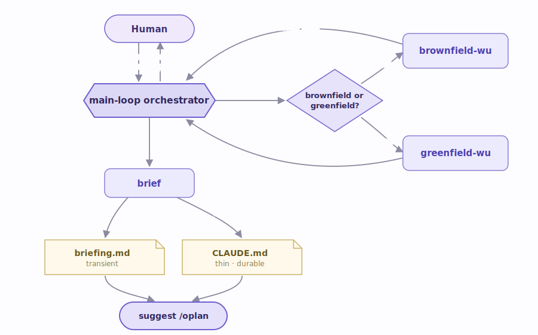
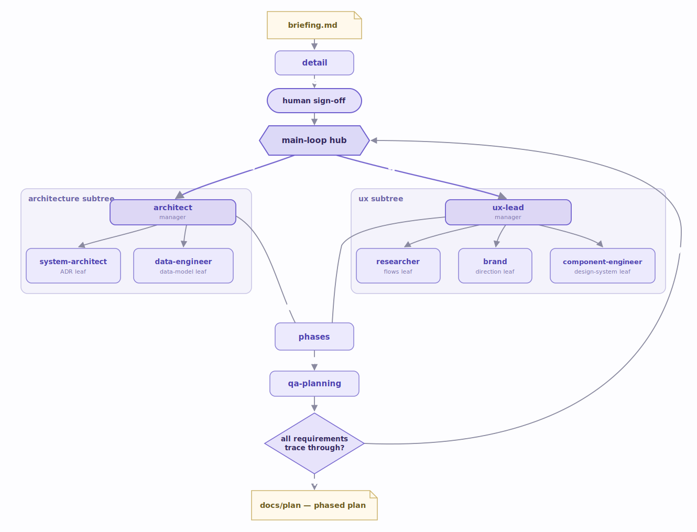
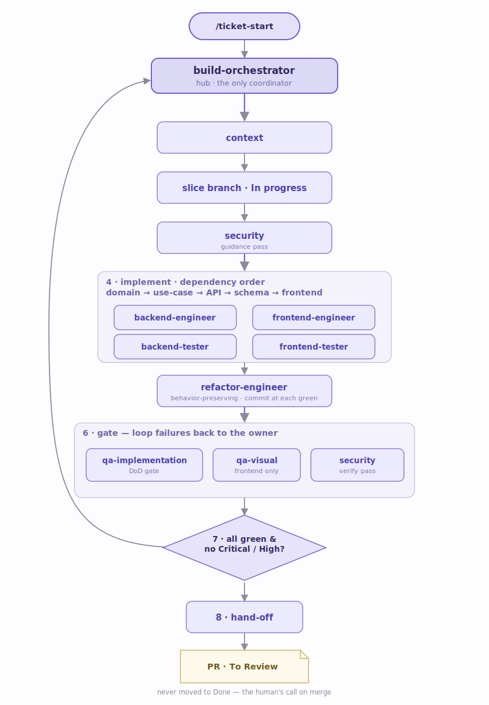
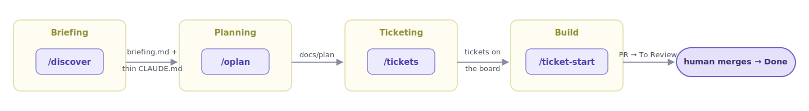

# kodi agents & orchestration

kodi ships a **neutral team of sub-agents** and drives them through three explicit
phases. There is **no auto-advancing pipeline and no message bus** — a human runs
one skill per phase, and the orchestrator coordinates the agents directly, producing
durable artifacts that the next phase reads.

Every agent knows its **role**, not your stack. The stack lives in a thin `CLAUDE.md`
(written during Briefing) and in installable **skill-packs** (`kodi add`), so the same
engineer agent builds a FastAPI service or a Next.js app without being rewritten.

Two laws hold across every phase:

- **Ask, never assume.** Every genuine decision (mode, scope, an ADR change, a gate
  that needs a human call) goes to the human.
- **ADR is law.** Approved decisions are followed; changing one stops the flow and
  surfaces it — never silently overridden.

| Phase       | Skill(s)             | Who orchestrates                 | Output                             |
| ----------- | -------------------- | -------------------------------- | ---------------------------------- |
| 1 Briefing  | `/discover`          | main-loop (on the main thread)   | `briefing.md` + thin `CLAUDE.md`   |
| 2 Planning  | `/oplan`, `/oreplan` | main-loop (hub-and-spoke)        | phased plan in `docs/plan`         |
| — Ticketing | `/tickets`, `/retickets` | main-loop → CLI              | tickets on the active board        |
| 3 Build     | `/ticket-start`      | `build-orchestrator` (sub-agent) | vertical slice → gates → PR        |

---

## Phase 1 — Briefing (`/discover`)

**Goal:** establish shared context *before* any planning. The main-loop is the only
one that talks to the human; the WU ("work-up") agents only investigate and report —
they never interview.

**Agents**

- **`brownfield-wu`** — runs only when code already exists. Scouts the repository and
  returns a ground-truth technical map: stack, architecture, patterns, integrations,
  test/coverage state, tech debt. It investigates; it does not interview.
- **`greenfield-wu`** — for new projects. Reads whatever seed material the human points
  to (docs, mockups, sample data, links, loose specs) and researches the domain,
  returning facts that ground the interview. Skipped when there is nothing to read.
- **`brief`** — the synthesizer, run at the end. Consumes the main-thread grill notes
  plus the WU reports and writes the two artifacts: `briefing.md` (root, transient —
  consumed by `/oplan`) and a thin `CLAUDE.md` (identity, stack or `TBD`, provider,
  gate commands, skill-packs, doc locations).

**Communication:** the WU agents run in parallel and return reports to the main-loop;
the main-loop reconciles them against the grill, raises open questions with the human,
then hands everything to `brief`. Coordination is direct — reports and file paths, no
shared bus.

---

## Phase 2 — Planning (`/oplan`)

**Goal:** turn `briefing.md` into a consolidated, MVP-first phased plan. The main-loop
runs a **hub-and-spoke** loop: for each *manager* it spawns the manager, which returns
a plan naming the *leaves* it needs; the **hub (main-loop) spawns the leaves** — managers
never spawn their own — then the manager validates the leaves' outputs for coherence.

**Order:** `detail` (PRD, human sign-off) → `architect` ∥ `ux-lead` (parallel,
sealed-bid; the hub reconciles cross-review and surfaces conflicts) → `phases`
(split into MVP-first phases) → `qa-planning` (validation gate). Loop until the gate
passes, then write `docs/plan` for human review.

**Agents**

- **`detail`** — authors the PRD from the briefing: the scope anchor everything
  downstream traces to. Human signs it off before architecture/UX begin.
- **`architect`** (manager) — plans the architecture work and later validates it; owns
  two leaves: **`system-architect`** (drafts decision-ready ADRs; never self-approves)
  and **`data-engineer`** (authoritative data model — entities, relationships,
  constraints, migrations — as a spec the backend later implements).
- **`ux-lead`** (manager) — plans the UX work and later validates it; owns three
  leaves: **`researcher`** (user flows and journeys from the PRD), **`brand`** (visual
  tone and direction), and **`component-engineer`** (the design system — tokens,
  component contracts, layout, a11y — as an authoritative spec the frontend executes).
- **`phases`** — splits the consolidated plan into MVP-first phases with dependencies
  and per-phase deliverables.
- **`qa-planning`** — the independent validation gate. Checks that every requirement
  traces through to a phase, with no orphans or placeholders, and blocks until the plan
  coheres.

> **`/oreplan <phase>`** re-plans or expands a **single** phase in `docs/plan` when new
> context arrives — it runs the same sub-loop scoped to one phase, shows the diff for
> sign-off, and never touches the board. If tickets already exist for that phase it flags
> the delta and hands it to `/retickets`.

---

## Ticketing (`/tickets`)

Between planning and building, `/tickets` turns a consolidated phase into actionable
board tickets — one phase at a time, on demand. It is not an agent phase: the main-loop
drives the **`kodi tickets` CLI**, which validates the ticket template and proxies the
active provider. Each ticket traces to its drivers (PRD / ADR / security) and declares
its dependencies so `kodi tickets list-ready` reflects the real order. **`/retickets`**
is its sibling: it revises *existing* tickets impact-first (and receives phase deltas
from `/oreplan`).

---

## Phase 3 — Build (`/ticket-start`)

**Goal:** drive **one** backlog ticket end-to-end as a **vertical slice**. Here the hub
is a sub-agent — **`build-orchestrator`** — spawned by `/ticket-start`. It owns the
branch, brackets the slice with security, delegates to engineers/testers/gates in
dependency order, and closes only when every gate is green. It coordinates; it never
writes feature code, tests, or reviews itself.

**Agents**

- **`build-orchestrator`** (hub) — the only coordinator; delegates in dependency order,
  runs the security bracket, loops gate failures back to the owning agent, and hands off.
- **`backend-engineer` / `frontend-engineer`** — write feature code in the project's
  recorded stack, respecting the `data-engineer` and `component-engineer` specs.
- **`backend-tester` / `frontend-tester`** — write the test suites (unit, integration,
  component, E2E) against the implemented behavior; they never change behavior to pass.
- **`refactor-engineer`** — the last implementation step, run **only once tests are
  green**: a behavior-preserving tidy (naming, duplication, long functions, dead code)
  in small steps, committed at each green safe state.
- **`qa-implementation`** — the Definition-of-Done gate: runs the full gate
  (lint / type-check / tests / coverage) and reviews the diff; blocks until it passes.
- **`qa-visual`** — the visual/UX gate (frontend slices only): fidelity to the design
  system, empty/loading/error states, responsiveness, accessibility.
- **`security`** — brackets the slice, run **twice**: a *guidance* pass before code
  (threat model + secure-coding requirements) and a *verify* pass at the gate (audits
  diff, dependencies, images, secrets), hard-gating on Critical/High findings.

**Close condition & hand-off.** The slice closes ONLY when every gate is green, there is
no open Critical/High security finding, and `qa-implementation` (and `qa-visual`, if the
slice touched frontend) are positive. On close, the orchestrator opens a
**template-validated PR** to **`To Review`** via `kodi pr` and runs `kodi tickets
hand-off`. If the security verify pass wrote reports under `docs/security/`, each is
listed on the PR (`--vulnerability`) so reviewers see findings that still need follow-up
tickets. The ticket is **never** moved to `Done` — that is the human's call on merge,
binding policy in `.claude/rules/ticket-completion.md`.

---

## How the phases connect

Each hand-off is a **durable artifact**, not a live channel — which is why any phase can
be re-run, resumed after a `/clear` or `/compact`, or picked up by a fresh session. The
`SessionStart` hook re-injects the orchestrator persona and the two laws every time.
