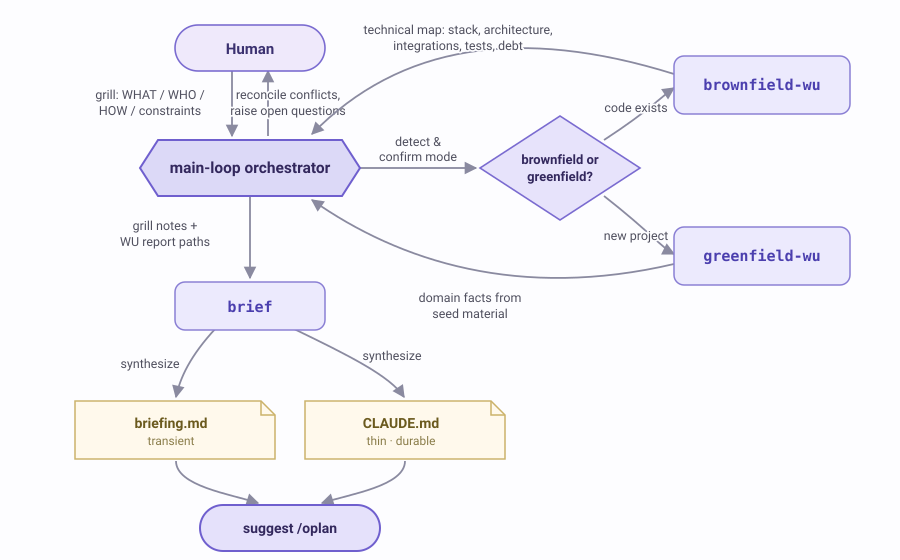
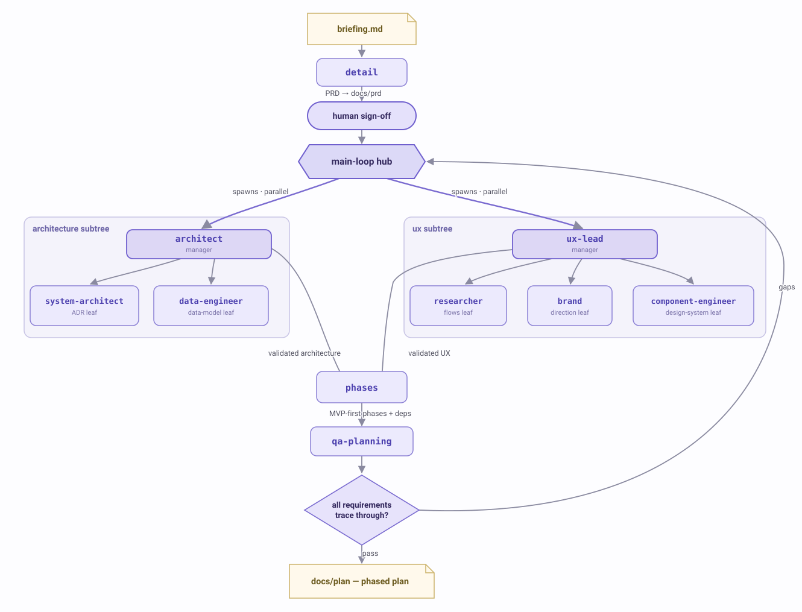
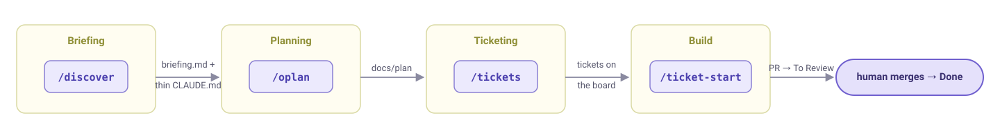

# kodi agents & orchestration

kodi ships a **neutral team of sub-agents** and drives them through three explicit
phases. There is **no auto-advancing pipeline and no message bus** — a human runs
one skill per phase, and the orchestrator coordinates the agents directly, producing
durable artifacts that the next phase reads.

Every agent knows its **role**, not your stack. The stack lives in a thin `CLAUDE.md`
(written during Briefing) and in installable **skill-packs** (`kodi add`), so the same
engineer agent builds a FastAPI service or a Next.js app without being rewritten.

Two laws hold across every phase:

- **Ask, never assume.** Every genuine decision (mode, scope, an ADR change, a gate
  that needs a human call) goes to the human.
- **ADR is law.** Approved decisions are followed; changing one stops the flow and
  surfaces it — never silently overridden.

| Phase       | Skill(s)             | Who orchestrates                 | Output                             |
| ----------- | -------------------- | -------------------------------- | ---------------------------------- |
| 1 Briefing  | `/discover`          | main-loop (on the main thread)   | `briefing.md` + thin `CLAUDE.md`   |
| 2 Planning  | `/oplan`, `/oreplan` | main-loop (hub-and-spoke)        | phased plan in `docs/plan`         |
| — Ticketing | `/tickets`, `/retickets` | main-loop → CLI              | tickets on the active board        |
| 3 Build     | `/ticket-start`      | `build-orchestrator` (sub-agent) | vertical slice → gate → PR         |
| — On demand | `/security`, `/refactor` | main-loop (no sub-agents)    | audit reports / a tidied target    |

---

## Phase 1 — Briefing (`/discover`)

**Goal:** establish shared context *before* any planning. The main-loop is the only
one that talks to the human; the WU ("work-up") agents only investigate and report —
they never interview.

**Agents**

- **`brownfield-wu`** — runs only when code already exists. Scouts the repository and
  returns a ground-truth technical map: stack, architecture, patterns, integrations,
  test/coverage state, tech debt. It investigates; it does not interview.
- **`greenfield-wu`** — for new projects. Reads whatever seed material the human points
  to (docs, mockups, sample data, links, loose specs) and researches the domain,
  returning facts that ground the interview. Skipped when there is nothing to read.
- **`brief`** — the synthesizer, run at the end. Consumes the main-thread grill notes
  plus the WU reports and writes the two artifacts: `briefing.md` (root, transient —
  consumed by `/oplan`) and a thin `CLAUDE.md` (identity, stack or `TBD`, provider,
  gate commands, skill-packs, doc locations).

**Communication:** the WU agents run in parallel and return reports to the main-loop;
the main-loop reconciles them against the grill, raises open questions with the human,
then hands everything to `brief`. Coordination is direct — reports and file paths, no
shared bus.

---

## Phase 2 — Planning (`/oplan`)

**Goal:** turn `briefing.md` into a consolidated, MVP-first phased plan. The main-loop
runs a **hub-and-spoke** loop: for each *manager* it spawns the manager, which returns
a plan naming the *leaves* it needs; the **hub (main-loop) spawns the leaves** — managers
never spawn their own — then the manager validates the leaves' outputs for coherence.

**Order:** `detail` (PRD, human sign-off) → `architect` ∥ `ux-lead` (parallel,
sealed-bid; the hub reconciles cross-review and surfaces conflicts) → `phases`
(split into MVP-first phases) → `qa-planning` (validation gate). Loop until the gate
passes, then write `docs/plan` for human review.

**Agents**

- **`detail`** — authors the PRD from the briefing: the scope anchor everything
  downstream traces to. Human signs it off before architecture/UX begin.
- **`architect`** (manager) — plans the architecture work and later validates it; owns
  two leaves: **`system-architect`** (drafts decision-ready ADRs; never self-approves)
  and **`data-engineer`** (authoritative data model — entities, relationships,
  constraints, migrations — as a spec the backend later implements).
- **`ux-lead`** (manager) — plans the UX work and later validates it; owns three
  leaves: **`researcher`** (user flows and journeys from the PRD), **`brand`** (visual
  tone and direction), and **`component-engineer`** (the design system — tokens,
  component contracts, layout, a11y — as an authoritative spec the frontend executes).
- **`phases`** — splits the consolidated plan into MVP-first phases with dependencies
  and per-phase deliverables.
- **`qa-planning`** — the independent validation gate. Checks that every requirement
  traces through to a phase, with no orphans or placeholders, and blocks until the plan
  coheres.

> **`/oreplan <phase>`** re-plans or expands a **single** phase in `docs/plan` when new
> context arrives — it runs the same sub-loop scoped to one phase, shows the diff for
> sign-off, and never touches the board. If tickets already exist for that phase it flags
> the delta and hands it to `/retickets`.

---

## Ticketing (`/tickets`)

Between planning and building, `/tickets` turns a consolidated phase into actionable
board tickets — one phase at a time, on demand. It is not an agent phase: the main-loop
drives the **`kodi tickets` CLI**, which validates the ticket template and proxies the
active provider. Each ticket traces to its drivers (PRD / ADR / security) and declares
its dependencies so `kodi tickets list-ready` reflects the real order. **`/retickets`**
is its sibling: it revises *existing* tickets impact-first (and receives phase deltas
from `/oreplan`).

---

## Phase 3 — Build (`/ticket-start`)

**Goal:** drive **one** backlog ticket end-to-end as a **vertical slice**. Here the hub
is a sub-agent — **`build-orchestrator`** — spawned by `/ticket-start`. It scouts the
slice once, delegates one engineer per side, verifies the sides fit together, and is the
**only** agent that declares the ticket green. It coordinates and judges; it never
writes feature code, tests, or reviews itself.

**Agents**

- **`build-orchestrator`** (hub) — scouts the slice ONCE and writes the Slice Brief every
  sub-agent works from, spawns only the side(s) the slice needs, then does what no single
  engineer can see: that the two sides speak the same contract, that every acceptance
  criterion is claimed by somebody, and that the cross-side check is clean. **Declaring
  the ticket green — and only then opening the PR and handing off — is its call and
  nobody else's.** Failures route back to the owning engineer, capped at 2 rounds.
- **`backend-engineer` / `frontend-engineer`** — each owns **one side end to end**: the
  feature code, its unit/integration/component/E2E tests, and its own QA loop, in a
  single context. Code and tests are never split across agents — that split is what made
  a slice slow, expensive and context-poor. Both report to the orchestrator.
- **`backend-qa` / `frontend-qa`** — each is invoked by **its own engineer**, not by the
  orchestrator, and answers to that engineer. Each verifies **criterion by criterion**
  that the side actually meets the ticket, runs that side's gate once, and returns one of
  three verdicts per criterion:
  - **MET** — built as specified and asserted by a test.
  - **MET DIFFERENTLY** — the goal is reached another way, allowed **only** with a
    convincing, evidenced justification: what the ticket asked verbatim, what was built,
    the proof it achieves the same goal, and why the literal wording was impossible.
    Missing any of the four makes it NOT MET. Every accepted deviation is carried up to
    the orchestrator and into the PR body.
  - **NOT MET** — missing, wrong or unasserted. Blocking, routed back to the engineer.

  `frontend-qa` additionally owns the visual/UX check: design-system fidelity,
  empty/loading/error states, responsiveness, accessibility.

**Not in the slice.** Security auditing and refactoring are **human-invoked skills**, not
build steps: **`/security`** hunts vulnerabilities in a scope *you* name (the diff, a
path, a feature, the whole project) and writes one `docs/security/` report per confirmed
breach; **`/refactor`** cleans up a target *you* name, behavior-preservingly, in small
committed steps under a green suite. The orchestrator never spawns either — it only
flags in its report when a slice surfaced something worth one.

**Close condition & hand-off.** The ticket is green when every criterion is MET or an
accepted MET DIFFERENTLY, both QA verdicts passed, and the orchestrator's cross-side
check is clean. On that call, the orchestrator opens a **template-validated PR** to
**`To Review`** via `kodi pr` — recording every accepted deviation in the body — and runs
`kodi tickets hand-off`. The ticket is **never** moved to `Done`: that is the human's
call on merge, binding policy in `.claude/rules/ticket-completion.md`.

---

## How the phases connect

Each hand-off is a **durable artifact**, not a live channel — which is why any phase can
be re-run, resumed after a `/clear` or `/compact`, or picked up by a fresh session. The
`SessionStart` hook re-injects the orchestrator persona and the two laws every time.
